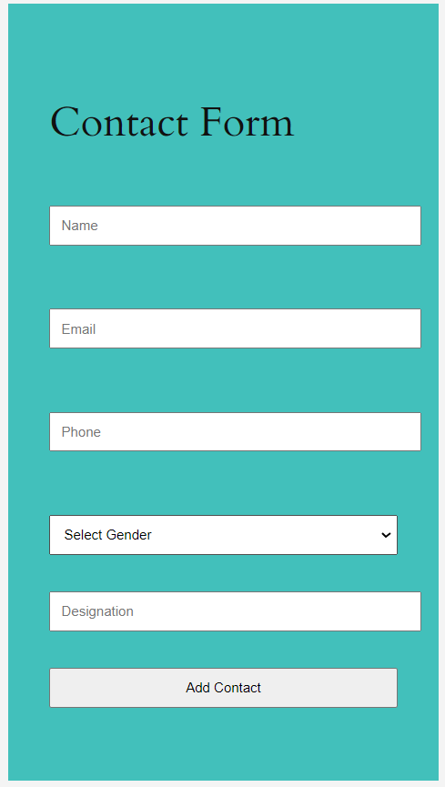
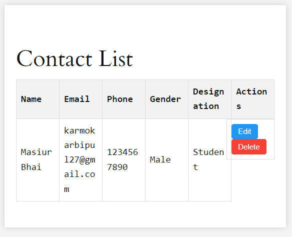

# Contact Management Plugin with Shortcode

## Description
The Contact Management Plugin is a simple and efficient contact management system for WordPress. This plugin allows you to add, edit, and delete contacts with ease. It displays the contact list in a beautiful, responsive table format.

## Features
- Add new contacts with details including name, email, phone, gender, and designation.
- Edit existing contacts.
- Delete contacts.
- Responsive table display of contacts.
- Real-time form validation.

## Installation
1. Download the plugin zip file.
2. Log in to your WordPress dashboard.
3. Go to `Plugins > Add New` and click `Upload Plugin`.
4. Choose the downloaded zip file and click `Install Now`.
5. Activate the plugin after installation.

## Usage
1. Create a new page or post where you want to display the contact management system.
2. Add the following shortcode to the page or post content:
3. Publish or update the page/post.

## Shortcodes
- `[contact_management]`: Displays the contact management form and the contact list.

## Screenshots
### Contact Form

### Contact List

### How do I add a new contact?
To add a new contact, simply fill out the contact form with the required details and click the "Add Contact" button. The contact will be added to the list below the form.

### How do I edit a contact?
Click the "Edit" button next to the contact you want to edit. Update the contact details in the form that appears and click the "Update Contact" button.

### How do I delete a contact?
Click the "Delete" button next to the contact you want to remove. The contact will be deleted from the list.

